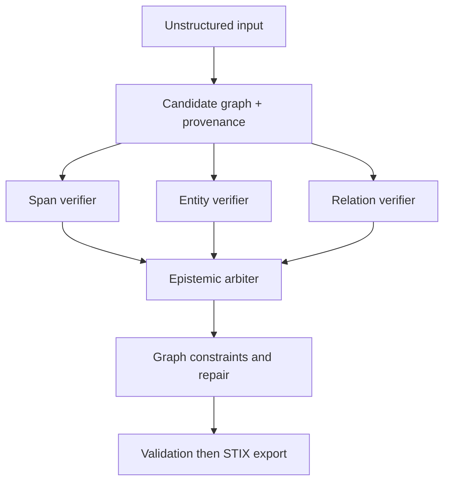

# Agent Skill

Corrobore provides portable prompts and skill files for agent runtimes. Use this page as an index: each card explains the purpose and links to a downloadable prompt file.

## Install location

Place downloaded files under a client-specific skill or prompt directory.

| Client | Example path |
| :--- | :--- |
| Claude Code | `.claude/skills/corrobore/` |
| GitHub Copilot / VS Code | `.github/skills/corrobore/` |
| Cursor | `.cursor/skills/corrobore/` |

Consult each client documentation for discovery rules and naming constraints.

## Prompt library

**Core Corrobore Skill**

Generic operating manual for using Corrobore as bounded, external structured memory.

[Download SKILL.md](https://raw.githubusercontent.com/Noetance-Labs/corrobore/main/docs/skills/corrobore/SKILL.md)

**OpenCTI Harvester Agent**

End-to-end extraction prompt tuned for grounded CTI ingestion and deterministic STIX 2.1 export.

[Download AGENT.md](https://raw.githubusercontent.com/Noetance-Labs/corrobore/main/docs/skills/corrobore/AGENT.md)

**Single Agent: Corrobore Working Memory**

Minimal operational prompt for one agent that must use Corrobore as durable working memory.

[Download SINGLE-AGENT-WORKING-MEMORY.md](https://raw.githubusercontent.com/Noetance-Labs/corrobore/main/docs/skills/corrobore/prompts/SINGLE-AGENT-WORKING-MEMORY.md)

**Single Agent: FIMI Investigation**

Investigation prompt focused on narratives, claims, amplification, coordination, and uncertainty handling for FIMI.

[Download SINGLE-AGENT-FIMI-INVESTIGATION.md](https://raw.githubusercontent.com/Noetance-Labs/corrobore/main/docs/skills/corrobore/prompts/SINGLE-AGENT-FIMI-INVESTIGATION.md)

**Single Agent: CTI Investigation**

Investigation prompt focused on threat entities, relationships, attribution discipline, and evidence-backed graph updates.

[Download SINGLE-AGENT-CTI-INVESTIGATION.md](https://raw.githubusercontent.com/Noetance-Labs/corrobore/main/docs/skills/corrobore/prompts/SINGLE-AGENT-CTI-INVESTIGATION.md)

**Single Agent: STIX Bundle From Unstructured Data**

Extraction prompt for converting unstructured reports into one validated STIX 2.1 bundle with strict provenance constraints.

[Download SINGLE-AGENT-STIX-BUNDLE-FROM-UNSTRUCTURED.md](https://raw.githubusercontent.com/Noetance-Labs/corrobore/main/docs/skills/corrobore/prompts/SINGLE-AGENT-STIX-BUNDLE-FROM-UNSTRUCTURED.md)

**Agentic Flow: Evidence-First Validation**

Multi-step verification flow with independent validators, epistemic arbitration, graph repair, and deterministic export.

[Download AGENTIC-FLOW-EVIDENCE-FIRST-VALIDATION.md](https://raw.githubusercontent.com/Noetance-Labs/corrobore/main/docs/skills/corrobore/prompts/AGENTIC-FLOW-EVIDENCE-FIRST-VALIDATION.md)

## Recommended orchestration pattern

Use a hybrid extraction and verification flow where each assertion is atomic, evidence-backed, and evaluated independently before export.

See also [For LLM Agents](for-llms.md), [Cypher Support](user-guide/cypher.md), and [Exporters & Validation](user-guide/exporters.md).
