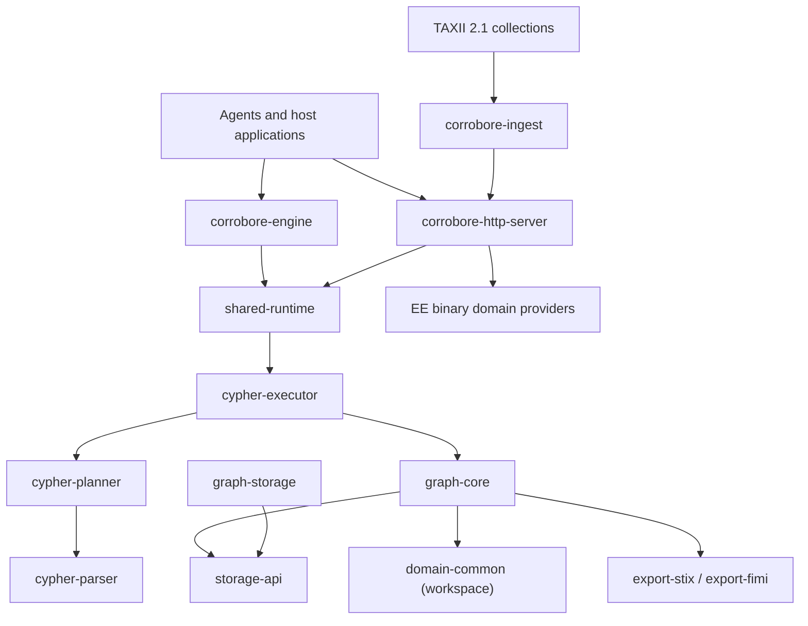

# Architecture

Corrobore separates graph semantics, query execution, runtime policy, transport, ingestion, and export so each boundary can be tested and replaced independently.

This guide targets the current `0.1.x` runtime baseline.



## Workspace crates

| Crate | Responsibility |
| :--- | :--- |
| `corrobore-engine` | Synchronous embedded facade plus the versioned, backend-neutral Knowledge Data Engine provider contract for lifecycle, typed reads, graph operations, writes and durability. |
| `corrobore-http-server` | Axum transport, authentication, limits, sessions, logs, metrics, and HTTP contracts. |
| `corrobore-ingest` | Incremental TAXII 2.1 polling and import through the public HTTP API. |
| `shared-runtime` | Agent-safe request modes, policies, budgets, validation, audit events, and the Cypher gateway. |
| `cypher-parser` | Parses and classifies the supported Cypher subset. |
| `cypher-planner` | Builds deterministic logical plans. |
| `cypher-executor` | Executes plans against the graph under an execution policy. |
| `graph-core` | Graph model, traversal, temporal and epistemic primitives, semantic seeds, bounded working sets, learned-navigation signals, and benchmarks. |
| `storage-api` | Backend-neutral durable record contracts. |
| `graph-storage` | Append-only file-backed records, manifests, catalogs, recovery, and paging support. |
| `domain-common` | Shared evidence and domain-agnostic validation primitives. |
| `function-registry` | Typed `namespace.symbol` registration and dispatch. |
| `export-stix`, `export-fimi` | Deterministic projections into interchange formats. |

Enterprise domain logic (`cti`, `fimi`, `crisis`) is externalized to dedicated EE repositories and consumed at runtime through the shared `domain-provider-abi` contract. The core host loads a private deployment manifest once at startup, confines libraries to a trusted root, verifies SHA-256 digests, negotiates the prefix-versioned C ABI, validates metadata and capabilities, and health-checks instances before serving. Source and binaries for those domains are intentionally not shipped in the OSS image; a private EE image layers all licensed providers onto the unchanged core runtime.

## Repository boundaries (multi-repo)

Corrobore keeps a strict separation between the core runtime repository and
integration repositories:

- this repository owns the runtime contracts (`corrobore-engine`,
    `corrobore-http-server`), graph/query internals, and public API behavior;
- connectors and integration assets consume those contracts through stable
    boundaries (primarily HTTP), so they can evolve and release independently.

For ingestion specifically, `corrobore-ingest` remains an external connector in
its architecture role even when developed from the same workspace. It relies on
the public import route instead of graph internals, which preserves auth,
validation, and audit invariants across deployment topologies.

Some integration assets (for example XTM One) have been moved to dedicated
repositories, while still targeting the same runtime interfaces.

## Request path

Every embedded or HTTP Cypher request follows the same boundary:

```text
request identity + mode + parameters
        -> runtime policy and budget checks
        -> parse and classify
        -> logical plan
        -> bounded execution
        -> response + mutation summary + audit data
```

Read and write availability is controlled by the host. The HTTP API exposes explicit read and write routes; embedded callers can build a read-only engine. Unsupported or unsafe clauses are rejected before execution.

## Working-set navigation

`GraphWorkingSetManager` holds a bounded hot/warm view of a larger graph. The implemented learned-navigation layer is observable and deterministic at its interfaces:

- retrieval telemetry records decisions, page-ins, prefetches, evictions, dead ends, evidence, cost, latency, and outcome;
- task-scoped pheromone vectors accumulate positive utility with temporal decay;
- anti-pheromone vectors penalize dead ends, supernodes, stale or contradictory paths, and integrity risks;
- a contextual controller chooses from explicit working-set actions and observes scalarized rewards;
- the benchmark harness compares classic and learned policy families on a reproducible FIMI multi-hop workload.

The remaining Epic 0017 acceptance report is not presented as completed; see [Learned Working Set](user-guide/working-set.md) for the implemented surface and limitations.

## Durability and transport boundaries

The current HTTP runtime keeps its graph in process. Session metadata and JSONL logs are durable on disk, while `graph-storage` provides the append-only storage and pager building blocks used by lower-level integrations. `corrobore-ingest` deliberately imports through HTTP instead of depending on graph internals.

## Design records

Architecture Decision Records and feature artifacts live in `project-documents/`. They explain design intent, but only public interfaces present in the workspace are described here as available behavior. See [Engine Internals](developer-guide/internals.md).

## Canonical references

- [HTTP Server](user-guide/http-server.md)
- [Cypher Support](user-guide/cypher.md)
- [Embedded Engine](user-guide/embedded-engine.md)
- [OpenAPI specification](api/openapi.yaml)
