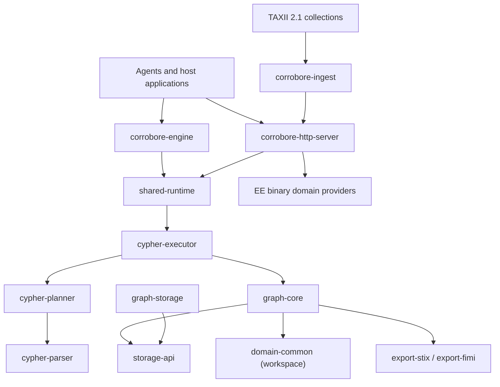

# Architecture

Corrobore separates graph semantics, query execution, runtime policy, transport, ingestion, and export so each boundary can be tested and replaced independently.

This guide describes the current runtime contract.



## Workspace crates

| Crate | Responsibility |
| :--- | :--- |
| `corrobore-engine` | Synchronous embedded facade plus the versioned, backend-neutral Knowledge Data Engine provider contract for lifecycle, typed reads, graph operations, writes and durability. |
| `corrobore-http-server` | Axum transport, authentication, limits, sessions, logs, metrics, and HTTP contracts. |
| `corrobore-ingest` | Incremental TAXII 2.1 polling and import through the public HTTP API. |
| `shared-runtime` | Agent-safe request modes, policies, budgets, validation, audit events, and the Cypher gateway. |
| `cypher-parser` | Parses and classifies the supported Cypher subset. |
| `cypher-planner` | Builds deterministic logical plans. |
| `cypher-executor` | Executes plans against the graph under an execution policy. |
| `graph-core` | Graph model, traversal, temporal and epistemic primitives, semantic seeds, bounded working sets, learned-navigation signals, and benchmarks. |
| `storage-api` | Backend-neutral durable record contracts. |
| `graph-storage` | Append-only file-backed records, manifests, catalogs, recovery, and paging support. |
| `domain-common` | Shared evidence and domain-agnostic validation primitives. |
| `function-registry` | Typed `namespace.symbol` registration and dispatch. |
| `export-stix`, `export-fimi` | Deterministic projections into interchange formats. |

Enterprise domain logic (`cti`, `fimi`, `crisis`) is externalized to dedicated EE repositories and consumed at runtime through the shared `domain-provider-abi` contract. The core host loads a private deployment manifest once at startup, confines libraries to a trusted root, verifies SHA-256 digests, negotiates the prefix-versioned C ABI, validates metadata and capabilities, and health-checks instances before serving. Source and binaries for those domains are intentionally not shipped in the OSS image; a private EE image layers all licensed providers onto the unchanged core runtime.

## Repository boundaries (multi-repo)

Corrobore keeps a strict separation between the core runtime repository and
integration repositories:

- this repository owns the runtime contracts (`corrobore-engine`,
    `corrobore-http-server`), graph/query internals, and public API behavior;
- connectors and integration assets consume those contracts through stable
    boundaries (primarily HTTP), so they can evolve and release independently.

For ingestion specifically, `corrobore-ingest` remains an external connector in
its architecture role even when developed from the same workspace. It relies on
the public import route instead of graph internals, which preserves auth,
validation, and audit invariants across deployment topologies.

Some integration assets (for example XTM One) have been moved to dedicated
repositories, while still targeting the same runtime interfaces.

## Candidate ingestion and reconciliation (WS-C)

External extractors submit raw candidate versions through the HTTP candidate
contract. `EpistemicStores.candidates` reuses the existing Shadow/Hypothesis
tiers and retains extraction runs, caller-supplied constraints, precise failure
feedback and repair predecessor links. A successful constraint check does not
create canonical records. Explicit reviewed promotion is an atomic engine
mutation, with the candidate history retained.

Observation-bound mentions remain distinct from canonical entities. Reconciliation
judgments carry contextual source citations and an actor/verifier, and may merge,
distinguish or abstain. Application and undo use an append-only dependency ledger:
the read projection groups immutable mention records, and a reversible leaf merge
restores the original observation links. Dependent judgments prevent silent
cascading reversal. Extraction and identity classification stay outside the core.

Independent ingestion evaluations produce quality metrics from governed metadata,
without loading canonical payloads during a scrape. They keep extraction accuracy,
repair success, false repair and abstention visible as separate measurements.
Agent recipes use the candidate loop rather than direct graph writes.

The [ingestion contract and acceptance matrix](user-guide/ingestion.md#candidate-ingestion-ws-c)
link Spikes B/D, HTTP undo, metric coverage and unchanged WS-A/WS-B/WS-D gates.

## Claim audit and analyst decisions (WS-F)

`Graph::claim_audit_path` assembles a deterministic view of retained epistemic
records and exact provenance bindings. The authenticated HTTP GET delegates
through the engine; it does not execute resolution, verification or ingestion.
Coverage is a read projection of the current retained verifier records; stored
verdict dimensions and cluster explanations are returned without recomputation.

Analyst annotations, overrides and reversals use a separate append-only ledger.
The HTTP POST persists an atomic engine mutation with idempotent decision IDs.
The actor is caller-attributed. Neither an override nor its reversal modifies an
observation, verification or machine verdict. Scoped export archives preserve
selected provenance closure and stable link indices; native memory exports carry
the full snapshot. Restoration validates consistency before exposing the audit.

The UI and agent playbooks consume these same read/write boundaries. See the
[audit guide and WS-F acceptance matrix](user-guide/claim-audit.md) for executable
evidence, known gaps and the offline import contract.

## Request path

Every embedded or HTTP Cypher request follows the same boundary:

```text
request identity + mode + parameters
        -> runtime policy and budget checks
        -> parse and classify
        -> logical plan
        -> bounded execution
        -> response + mutation summary + audit data
```

Read and write availability is controlled by the host. The HTTP API exposes explicit read and write routes; embedded callers can build a read-only engine. Unsupported or unsafe clauses are rejected before execution.

## Working-set navigation

`GraphWorkingSetManager` holds a bounded hot/warm view of a larger graph. The implemented learned-navigation layer is observable and deterministic at its interfaces:

- retrieval telemetry records decisions, page-ins, prefetches, evictions, dead ends, evidence, cost, latency, and outcome;
- task-scoped pheromone vectors accumulate positive utility with temporal decay;
- anti-pheromone vectors penalize dead ends, supernodes, stale or contradictory paths, and integrity risks;
- a contextual controller chooses from explicit working-set actions and observes scalarized rewards;
- the benchmark harness compares classic and learned policy families on a reproducible FIMI multi-hop workload.

The Epic 0017 acceptance suite and reproducibility report are complete; see [Learned Working Set](user-guide/working-set.md) for the implemented surface, benchmark results, and evidence scope.

## Epistemic stores (Epic 0029)

Beside nodes, relationships, and first-class evidence, a graph carries the
governed evidence stores of ADR-0016: `Source` versions, immutable
`Observation`s, immutable `EntityMention`s and evidence-cited
`ReconciliationRecord`s, the `ClaimStore` (claims, evidence links, stances, workspaces,
trust inputs, policies, explanations), `VerificationRecord`s, and the
`VerdictStore` (verdicts, state transitions, reachability gaps). They travel
with the graph in three ways:

- `GraphPersistenceSnapshot` includes them under `epistemic`, skipped when
  empty so snapshots written before Epic 0029 stay byte-identical;
- the canonical durable store persists them in the
  `runtime/epistemic-records-v1.json` sidecar with the same stage, promote,
  recover, and discard discipline as the evidence sidecar, and serves them in
  every projection;
- backups copy the runtime directory, so the sidecar is part of every backup.

The verdict is a computed view: `resolve_claim_verdict` derives it from active
evidence links and deterministic verification records, enforces the
observation-reachability gate, appends verdict and transition records, and
projects the lifecycle `ClaimStatus`. No Cypher, HTTP, or memory route writes
a verdict. Reads reach the records through `Graph::epistemic_projection()`, a
read-only graph in the epistemic vocabulary documented in the
[Cypher guide](user-guide/cypher.md#epistemic-projection-epic-0029). STIX and
FIMI exports add `x_corrobore_lineage` and `lineage` entries (source,
observation, current verdict) only when governed records exist.

Verification follows the ADR-0017 deterministic-first boundary. Core checks
cover public syntax, hashes, temporal and arithmetic coherence, graph
consistency, and pack-supplied schemas; domain verifiers enter through the
`claim.verify/1` provider capability. A deterministic failure cannot be
overridden by a semantic score, while advisory disagreement stays visible.
`VerificationCoverage` derives one current entry per verifier from the claim,
its optional proposition, and append-only verification history. It exposes
mechanical, semantic, unchecked, and failing coverage on projected claim and
verification nodes and inside STIX/FIMI lineage, without persisting a second
report or changing precedence when a domain pack is absent.

Source independence (WS-D item 2) is reported as dependency components, not a
bounded confidence score. Resolution assigns `EvidenceLink::independence_cluster`
from source identity and ancestry, publisher, upstream citations, artifact
identity, and extraction run or qualified model pipeline. Additional source
signals are carried by `SourceDependencySignals`; existing evidence extraction
metadata is also consumed. Near-duplicate artifacts require an explicit digest
reference and attributed reason; similar-looking SHA-256 strings never imply
similar content.

`Verdict::source_independence()` retains an explainable snapshot, including
membership positions in `ClaimStore::claim_links()` and the signal connecting
each pair. Its `supporting_cluster_count()` counts components with supporting
links. Separate components mean no recorded dependency, not proven independence;
links with no assignable provenance get explicit unknown-independence singletons.
Projected verdicts expose `verdict_source_independence_supporting_clusters` and
`verdict_source_independence_unknown_clusters`. The bounded
`confidence_dimensions.source_independence` stays absent in historical policies;
its current scoring rule is defined below. A structure change appends a verdict snapshot even if the state
stays the same; it does not append a false state transition. Weighting and
authority remain outside this component.

Source authority (WS-D item 3) is registered through
`VerdictStore::register_source_authority_policy`. Each immutable
`SourceAuthorityPolicy` binds a source identity, authority domain and predicate
class to an explicit bounded weight. A conflicting re-registration under the
same version fails; a new version retains earlier policies and verdicts.
Registries also persist when no verdict has been computed yet.

Callers select the exact version and scope with
`ResolutionInputs::with_source_authority(version, domain, predicate_class)`;
there is no latest-version fallback or inferred classification from claim text.
Only registered sources behind active supporting, refuting or contradicting
links contribute. No binding means absent authority, even when trust inputs
exist. Authority never creates a support signal or changes deterministic
verification precedence.

The stored `SourceReliabilityCapV1` rule caps a binding by the minimum applicable
`TrustInputKind::SourceReliability` value for that source. Inputs scoped to other
claims, future inputs and expired/superseded inputs are excluded; untimed inputs
apply unless explicitly scoped elsewhere. Other reliability categories are not
source authority. `Verdict::authority_resolution()` retains the binding,
effective weight, consumed inputs and their provenance/reason references. The
`source_authority` dimension is the maximum known effective weight among distinct
signal sources, so repeated records cannot raise it; cluster contribution
weighting uses the WS-D item 4 policy below. The exact authority version, domain and
predicate class are also exposed as `verdict_source_authority_*` properties.
Changing authority produces a new verdict snapshot without rewriting history or
creating a false state transition.

Cluster aggregation (WS-D item 4) is the default for new resolutions through
`resolve_current_claim_verdict`, under `ws-d-cluster-v1`.
`resolve_claim_verdict` still accepts an explicit historical policy label,
`ws-a-minimal-v1` or `deterministic-first-v1`, for compatible replay. Unknown
versions are rejected before mutation. A policy change appends a
new snapshot even when the verdict state is unchanged.

For each direction (support or refutation), a cluster uses only members with
explicit strength and resolved authority. Members with missing inputs cannot
borrow a weight; zero weights yield an explicit zero contribution and no bonus.
For `n` positive members, best strength `s`, and maximum eligible authority `a`,
the versioned contribution is:

```text
increment = 0.01 * (1 - s) * (1 - 1/n)
contribution = (s + increment) * a
combined = 1 - product(1 - contribution_per_cluster)
```

The increment is bounded, concave and headroom-scaled. These are deterministic
bounded indicators, not calibrated probabilities. Duplicate records in a
component can add at most one percentage point; distinct components contribute
separately. `Verdict::cluster_aggregation()` persists each component's best
strength, member count, increment, authority and resulting contribution.

WS-D item 5 retains a `HypothesisSet` on the resolution outcome and the stored
verdict. It contains the anchor claim and its direct, active claim-to-claim
`Contradicts` or `Supersedes` neighbors in either direction, without transitive
expansion. With no competitors it contains the anchor alone. Each alternative
keeps its state, complete dimensions, source dependency structure, directional
cluster contributions and authority-policy provenance, including losing entries.
Competitors are evaluated at the same bitemporal stamp and authority scope without
writing their lifecycle or verdict history.

Ranking first places `Supported` and `Mixed` alternatives ahead of rejected or
unresolved alternatives. Within each group, the score is cluster-derived
`evidence_sufficiency * (1 - contradiction_load)`, descending; missing support
inputs remain absent and sort last. Equal scores use ascending claim identifiers.
This is a ranking indicator, not a calibrated probability or the legacy scalar
claim confidence. Deterministic failure retains its veto through state and
contradiction load. One independent high-authority source can therefore outrank
many dependent copies.

An alternative changing appends a new anchor snapshot even if the anchor state
stays unchanged, without a false state transition. Identical resolutions return
the retained set without appending a verdict. Persistence and the read-only graph
projection preserve the exact order and explanations: each `Verdict` node exposes
`verdict_hypothesis_set` as a JSON string, so alternatives remain available without
rerunning resolution. Historical policy replays leave this additive field absent.

The policy computes six dimensions independently:

| Dimension | Input and meaning |
| --- | --- |
| `evidence_sufficiency` | Combined support contributions; absent without eligible support inputs. |
| `source_authority` | Maximum resolved signal-source authority, as in WS-D item 3. |
| `source_independence` | `k / (k + 1)` for `k` supporting components with known provenance; the exact structure and unknown singletons remain in `source_independence()`. Separate components do not prove independence. |
| `temporal_validity` | One when any known stamped signal is active, zero when all known stamped signals are outside validity, absent without stamped signals. No unstated age-decay rule is applied. |
| `contradiction_load` | Refuting mass divided by total directional mass; a deterministic failure forces one. |
| `verifier_strength` | One for authoritative deterministic conclusive coverage, zero for advisory/inconclusive-only input, absent without known verification records. |

A deterministic failure remains non-trusted regardless of these dimensions.
Active links without enough explicit inputs abstain as `InsufficientEvidence`;
no evidence remains `Unknown`. The scalar claim confidence is never a fallback.
WS-D item 6 computes permission separately through `ActionabilityPolicy`.
The default `actionability-v1` requires a current, grounded deterministic pass,
at least two positively weighted supporting clusters with known provenance,
contradiction load at most 0.25, and temporal validity equal to one. A deterministic
failure or unsupported verdict blocks permission. All reasons accumulate in a
persisted `ActionabilityAssessment`, including the exact policy configuration.
Callers select a versioned claim-type policy with `with_actionability_policy`;
a type that does not require corroboration can require one cluster.
Missing required dimensions abstain (`actionability` absent); explicit blocked
and allowed decisions project to zero and one. Apparent support cannot replace
a grounded deterministic check.

The resolution outcome and `verdict_actionability` graph property expose the
assessment. A policy change creates a new snapshot without rewriting history.
Current resolutions derive scalar claim display confidence from
`min(evidence_sufficiency, source_independence) * verifier_strength`, omitting the
multiplier when verifier strength is absent; either missing base dimension leaves
the display absent. Aggregation, actionability, export planning and hybrid seed
ranking never read the stored scalar. Legacy `classify_confidence_band` callers
keep their behavior; exporters use `classify_confidence_band_with_actionability`
for governed lineage.

Export requires every claim targeting a selected node or relationship to have a
permitted current assessment. Historical assessments without permission abstain.
Strict export names the blockers; permissive export excludes the record. Forced
validation cannot bypass permission. Records without governed claims keep their
lifecycle, evidence and structural checks, without a scalar threshold. The CTI
export adapter does not send scalar confidence to providers and retains any
legacy confidence findings as `EXPORT_LEGACY_CONFIDENCE_DIAGNOSTIC` warnings.
The separate public CTI validation endpoint keeps its compatibility behavior;
other provider criteria retain their existing export enforcement.

Compatibility tests intentionally replace scalar-driven export and retrieval
expectations. Lineage fixtures now supply corroborated, mechanically verified
evidence before export. Historical verdict replay remains unchanged.

WS-D item 7 exposes `Verdict::explanation()` as a read-only explanation of the
retained snapshot. Each cluster carries every member's append-only link index
and captured stable reference, its dependency reasons, and its supporting and
refuting weights (best strength, contributing member count, bounded increment,
authority and resulting contribution). Missing weights and historical member
references remain absent; no live retrieval or re-aggregation fills them in.
The payload also retains the verdict state, policy and time, authority provenance,
named dimensions, permission assessment and ranked alternatives.

The primary `uncertainty_kind` is deterministic: active support with refutation
(or a mixed verdict) yields `unresolved_conflict`; otherwise expired evidence
with zero temporal validity yields `staleness`; otherwise multiple positively
scored supported/mixed hypotheses yield `ambiguity`; otherwise an unknown
verdict yields `ignorance`. A null kind means none of these causes was detected,
not certainty or permission to act. Permission remains the separate gate above.

Projection exposes the complete JSON as `verdict_explanation`, with an optional
`verdict_uncertainty_kind` token for filtering. FIMI and STIX include the same
payload in governed claim lineage, for nodes and relationships. Graphs without
governed records retain their previous export bytes.

The workstream gate is `cargo test -p graph-core --test epic_0029_ws_d_acceptance`.
It reuses the canonical fixtures rather than maintaining parallel copies:

| Epic #178 criterion | Evidence in the acceptance suite |
| :--- | :--- |
| One source plus ten copies does not inflate dimensions | `aggregation::spike_c_ten_copies_raise_no_dimension_materially` |
| Independent high-authority minority wins | `hypotheses::independent_minority_wins_and_losers_keep_cluster_scores` |
| Fabricated support cannot grant permission | `fabricated_evidence::fabricated_support_rises_but_actionability_stays_blocked_until_grounded_verification` |
| Membership, weights and uncertainty are explained | `explanation` fixtures |
| Scalar independence and blocked export | `permission::policy_paths_never_read_legacy_record_confidence`, `permission::blocked_claim_cannot_export_even_when_status_and_scalar_look_ready` |
| Legacy dimensions migrate with findings | `migration::legacy_unknown_keys_produce_persistent_findings_once_per_key` |
| Deterministic failure outranks aggregates | `aggregation::deterministic_failure_outranks_maximal_support`, `ws_b_precedence` |
| WS-A and WS-B compatibility | `ws_a_compatibility`, `ws_b_precedence` |

Exporter tests additionally cover additive explanation payloads and unchanged
ungoverned exports (`export-stix/tests/epistemic_lineage.rs` and the FIMI unit
contracts). The full workspace gate runs these alongside WS-D acceptance.

## Durability and transport boundaries

The current HTTP runtime keeps its graph in process. Session metadata and JSONL logs are durable on disk, while `graph-storage` provides the append-only storage and pager building blocks used by lower-level integrations. `corrobore-ingest` deliberately imports through HTTP instead of depending on graph internals.

## Design records

Architecture Decision Records and feature artifacts live in `project-documents/`. They explain design intent, but only public interfaces present in the workspace are described here as available behavior. See [Engine Internals](developer-guide/internals.md).

## Canonical references

- [Deployment Modes](user-guide/deployment-modes.md)
- [HTTP Server](user-guide/http-server.md)
- [Cypher Support](user-guide/cypher.md)
- [Embedded Engine](user-guide/embedded-engine.md)
- [OpenAPI specification](api/openapi.yaml)
