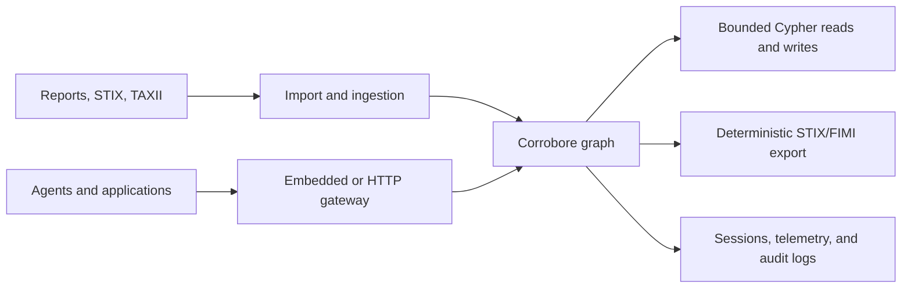

# Corrobore

Corrobore is a Rust-native, Cypher-compatible graph runtime built as structured
working memory for intelligence agents. It keeps entities, relationships,
evidence, confidence, temporal context, and audit history outside model context
while letting agents query and update only the smallest useful subgraph.

## Choose how to run Corrobore

Start with [Deployment Modes](user-guide/deployment-modes.md) for the
relationship between the embedded engine, HTTP interface, and standalone
server.

| Interface | Best for | Entry point |
| :--- | :--- | :--- |
| Embedded Rust | Applications that want an in-process engine | [`corrobore-engine`](user-guide/embedded-engine.md) |
| Standalone server | Durable native or container service operation | [`corrobore server`](user-guide/standalone-server.md) |
| HTTP API | Agent tools and services | [`corrobore-http-server`](user-guide/http-server.md) |
| TAXII ingestion | Incremental STIX 2.1 collection polling through the public HTTP import boundary | [`corrobore-ingest`](user-guide/ingestion.md) |
| Bolt (opt-in) | Neo4j drivers running the supported Cypher subset against the standalone server | [`bolt` interface](user-guide/bolt-protocol.md) |

## Repository model

Corrobore follows a multi-repo operating model:

- this repository owns core runtime behavior and contracts;
- connectors and integration assets consume those contracts through stable boundaries (primarily HTTP);
- integration repositories can evolve on their own cadence while preserving runtime compatibility.

See [Architecture](architecture.md) for crate-level boundaries and
[TAXII Ingestion](user-guide/ingestion.md) for connector deployment guidance.

## What is implemented

- an in-memory property graph with evidence, confidence, temporal metadata, snapshots, and epistemic claim primitives;
- governed evidence stores (Epic 0029): immutable sources and observations, typed evidence links, deterministic-first verifiers, computed verdicts with six named confidence dimensions over independence clusters, a separate actionability gate, and a one-read claim audit with reversible analyst decisions;
- candidate-first ingestion with constraint feedback, repair lineage, and reversible evidence-cited reconciliation;
- domain-neutral narrative and campaign collections, coordination signals stored as evidence, an attribution gate, and additive FIMI misleadingness export fields;
- agentic platform foundations: one capability catalogue behind HTTP and MCP adapters, agent write policy and run budgets decided outside the prompt with a hash-chained mutation log, why-provenance on executor results, corrective routes and falsifiers with a high-impact publish gate, capped memory fusion, and investigation artifacts bound to live records;
- a bounded Cypher parser, planner, and executor for reads and mutations;
- host-controlled runtime policies, budgets, and mutation permissions;
- an embedded Rust facade and an authenticated HTTP service;
- STIX import, deterministic STIX/FIMI export, native validation, and safe auto-correction;
- semantic seed search and a bounded working-set subsystem with telemetry, pheromone and anti-pheromone fields, a contextual controller, and reproducible benchmarks;
- durable session state, JSONL audit logs, health data, Prometheus metrics, rate limiting, body limits, and graceful shutdown;
- incremental TAXII 2.1 ingestion with persisted cursors.

The current public baseline is `0.3.x`. Historical context remains in release
notes, while this site describes behavior available on `main`.

Corrobore is not a distributed graph database and does not claim full openCypher support. Candidate R&D work is tracked separately under `project-documents/`; this site describes the code that exists on `main`.

## Start here

- [Getting Started](getting-started.md) — build, run, and validate locally.
- [Deployment Modes](user-guide/deployment-modes.md) — choose between embedded and service operation, then find the right HTTP or standalone reference.
- [HTTP Server](user-guide/http-server.md) — auth, routes, session model, and operations.
- [Embedded Engine](user-guide/embedded-engine.md) — in-process Rust integration.
- [TAXII Ingestion](user-guide/ingestion.md) — connector lifecycle and cursor behavior.
- [For LLM Agents](for-llms.md) — model operating boundaries.
- [Verdicts and Actionability](user-guide/verdicts-and-actionability.md) — how to read confidence dimensions, clusters, and the actionability gate.
- [Narratives, Campaigns, and Misleadingness](user-guide/narratives-and-campaigns.md) — neutral collections, coordination signals, and FIMI export fields.
- [Agentic Platform Foundations](user-guide/agentic-platform.md) — capability catalogue, write policy, provenance, corrective routes, artifacts.
- [Agent Plugin](agent-skill.md) — portable skills and the MCP bridge.
- [Cypher Support](user-guide/cypher.md) — exact supported query surface.
- [Architecture](architecture.md) — crate and runtime boundaries.
- [Interactive API reference](api/index.html) — browse HTTP API parameters and schemas.
- [OpenAPI specification](api/openapi.yaml) — raw OpenAPI 3.1 contract.
- [Release Notes](release-notes/v0.3.3.md) — current operational baseline and history.
