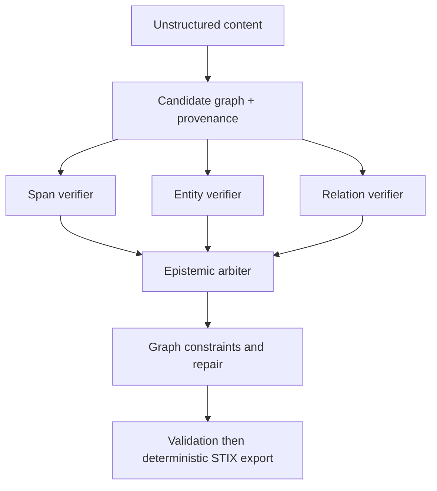

# Agentic Flow Prompt: Evidence-First Verification for CTI and FIMI

Use this flow when quality and traceability matter more than raw extraction speed.

## Executive principle

Do not ask agents to vote on truth. Build atomic assertions with provenance, then run independent verification layers.

Always separate:

1. source fidelity: does the document actually assert this relation?
2. external validity: is this assertion corroborated by reliable independent sources?

A source-faithful assertion can remain disputed as a fact. Keep both dimensions explicit.

## Recommended architecture

## Assertion schema (minimum)

Store per candidate assertion:

- subject, predicate, object;
- span offsets and quoted support passages;
- source, author, date;
- negation, modality, attribution;
- validity window;
- extractor identity and version;
- independent verifier decisions;
- external evidence references;
- epistemic status and calibrated score.

## Status vocabulary

Use status values richer than boolean acceptance:

- `supported-by-source`
- `externally-corroborated`
- `reported-but-unverified`
- `disputed`
- `contradicted`
- `insufficient-evidence`
- `inferred`

Never delete a source-faithful contradictory claim by default; keep it as an attributed assertion with contested status.

## Decision policy

Auto-accept only when:

- entities are span-grounded;
- relation and direction are entailed by text;
- negation/modality/attribution are checked;
- ontology constraints are satisfied;
- graph constraints hold;
- confidence is calibrated on comparable data.

Abstain or escalate when:

- entity disambiguation remains ambiguous;
- co-reference is uncertain;
- support is multi-document and incomplete;
- verifiers disagree with incompatible evidence;
- external sources conflict;
- claim is causal, prospective, or highly modal.

## Evaluation protocol

Track separately:

- entity boundary/type quality;
- relation F1 with direction/temporality;
- span evidence precision;
- support/contradict/insufficient classification quality;
- negation/modality/quotation resolution;
- ontology or STIX violations;
- calibration metrics (Brier or ECE);
- abstention-risk tradeoff;
- cost and latency per validated assertion;
- rate of justified vs abusive corrections.

## Operational guidance

Use debate as an escalation tool for ambiguous subgraphs only. Keep first-pass extraction and verification independent to reduce correlated error and premature consensus.
