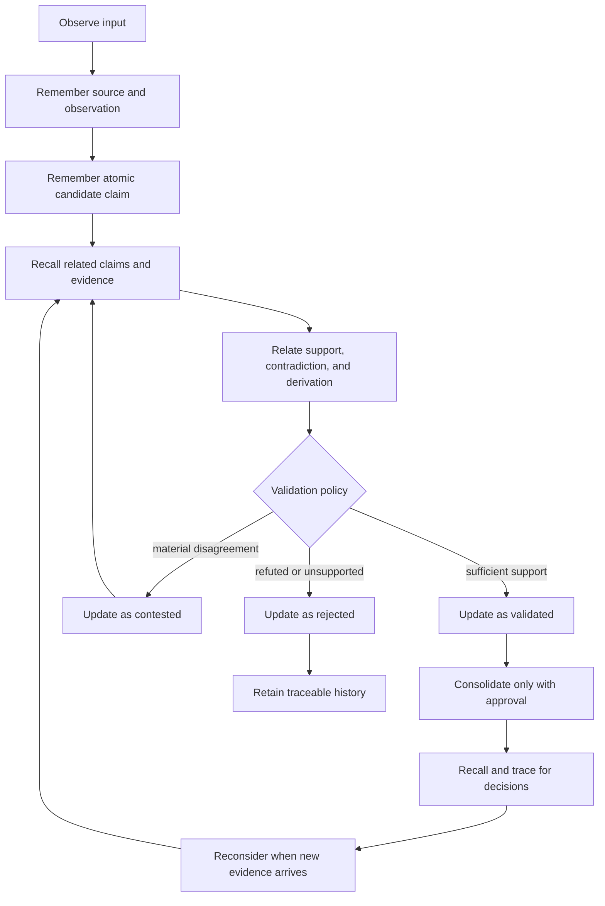

# Agent Memory Lifecycle

Corrobore gives agents durable, structured memory operations. It does not decide
what is true on the agent's behalf. An agent or its trusted host must record
where information came from, distinguish observations from assertions, apply a
named validation policy, preserve disagreement, and remain able to explain each
decision.

This guide defines a domain-neutral operating protocol for doing that with the
versioned `remember`, `relate`, `recall`, `update`, `forget`, `consolidate`, and
`trace` operations. For their complete request and response contracts, see
[High-level Memory Operations](memory-operations.md). For general tool and
authorization boundaries, see [For LLM Agents](../for-llms.md).

## Model memories explicitly

Use small, single-purpose records. A source, an observation made from that
source, and a claim inferred from the observation are different memories. This
separation lets later evidence challenge the claim without rewriting what was
originally observed.

The following `kind` values are recommended **application-owned conventions**.
They are not native Corrobore enums and the engine does not classify content
into them automatically.

| Suggested `kind` | Intended content | Typical retention |
| :--- | :--- | :--- |
| `working_state` | Current goal, plan, decision boundary, or unfinished task state. | Short and explicitly expired when the task ends. |
| `episode` | A dated event or interaction as it was experienced. | Retained as historical context under application policy. |
| `claim` | One atomic assertion that can be supported, contradicted, or revised. | Retained with its evidence and decision history. |
| `fact` | A claim promoted or derived under a named validation policy. | Durable but still revisable when new evidence appears. |
| `procedure` | A reusable method, rule, or sequence of actions. | Versioned when outcomes or policy change. |
| `source` | A document, message, sensor reading, or other provenance anchor. | At least as long as any dependent assertion requires it. |

Store the epistemic decision separately from `kind`, for example in a
structured `epistemic_status` property:

| Suggested status | Meaning |
| :--- | :--- |
| `candidate` | Recorded but not yet accepted by the applicable validation policy. |
| `validated` | Accepted by a named policy using the evidence currently available. |
| `contested` | Material supporting and contradicting evidence remains unresolved. |
| `rejected` | The validation policy found the assertion unsupported or refuted. |

These statuses are also application-owned conventions. Confidence is not proof,
and a high score must never replace provenance, independent evidence, temporal
scope, or an explicit validation decision.

## Follow the lifecycle

Use the following loop whenever information may affect an agent decision:



The trusted host, not untrusted request content, supplies workspace, actor,
agent, session, permissions, request identity, and correlation identity. Every
mutation uses a stable idempotency key. Read before writing so retries,
duplicate inputs, and existing contradictions are visible.

## Record an observation and candidate claim

First `remember` the source or observation. Give it a stable application
identity so processing the same source again is idempotent.

```json
{
  "contract_version": "v1",
  "idempotency_key": "source:deployment-guide:2026-07-01",
  "operation": "remember",
  "input": {
    "identity_key": "source:deployment-guide:2026-07-01",
    "kind": "source",
    "schema_version": "1",
    "content": {
      "format": "text_and_properties",
      "value": {
        "text": "Production uses PostgreSQL 17.",
        "properties": {
          "document_title": "Production deployment guide",
          "epistemic_status": "validated"
        }
      }
    },
    "provenance": [
      {
        "source_id": "deployment-guide",
        "locator": "database.md#production",
        "observed_at": "2026-07-01T09:00:00Z"
      }
    ],
    "confidence": 1.0,
    "valid_from": "2026-07-01T00:00:00Z",
    "valid_until": null,
    "expires_at": null,
    "tags": ["deployment", "database"]
  }
}
```

`confidence: 1.0` above means the source record accurately represents the cited
text. It does not make every assertion in the source objectively true.

Then `remember` one atomic `claim`. Include its time scope and validation state
in structured content. Do not combine unrelated assertions into one record.

```json
{
  "contract_version": "v1",
  "idempotency_key": "claim:production-database:postgresql:1",
  "operation": "remember",
  "input": {
    "identity_key": "claim:production-database:postgresql",
    "kind": "claim",
    "schema_version": "1",
    "content": {
      "format": "text_and_properties",
      "value": {
        "text": "The production service uses PostgreSQL 17.",
        "properties": {
          "subject": "production-service",
          "predicate": "uses_database",
          "object": "postgresql-17",
          "epistemic_status": "candidate",
          "validation_policy": null
        }
      }
    },
    "provenance": [
      {
        "source_id": "deployment-guide",
        "locator": "database.md#production",
        "observed_at": "2026-07-01T09:00:00Z"
      }
    ],
    "confidence": 0.7,
    "valid_from": "2026-07-01T00:00:00Z",
    "valid_until": null,
    "expires_at": null,
    "tags": ["database", "candidate"]
  }
}
```

Use `relate` to make the evidence role explicit. Recommended relationship kinds
include `supports`, `contradicts`, and `derived_from`; these names are also
application conventions.

```json
{
  "contract_version": "v1",
  "idempotency_key": "support:source-1:claim-1",
  "operation": "relate",
  "input": {
    "identity_key": "support:source-1:claim-1",
    "source_id": "<source-memory-id>",
    "target_id": "<claim-memory-id>",
    "kind": "supports",
    "properties": {"scope": "production", "independent": false},
    "provenance": [],
    "confidence": 1.0,
    "valid_from": "2026-07-01T00:00:00Z",
    "valid_until": null,
    "expires_at": null,
    "lifecycle": "active"
  }
}
```

## Validate without declaring truth by confidence

Validation is a policy decision over evidence, not a score threshold hidden in
the prompt. Before changing a claim:

1. `recall` the smallest bounded neighborhood around the claim and objective.
2. Check source identity, locator, observation time, and applicable validity
   window.
3. Separate genuinely independent sources from copies of the same origin.
4. Look for existing claims with overlapping subjects and time ranges.
5. Attach both supporting and contradicting evidence with `relate`.
6. Apply a named application policy or ask the trusted reviewer when the policy
   requires approval.
7. `update` the claim using its current version as `expected_version`.
8. Read the changed record back and use `trace` to verify attribution.

A policy might require two independent sources, no unresolved contradiction,
and validity dates that cover the decision time. Corrobore records the inputs
and versions; the application owns that rule.

When the policy accepts the claim, replace its structured content with a
complete updated value, append new provenance, and record the policy name.
`update.patch.content` replaces content rather than partially merging arbitrary
JSON, so preserve every property that must remain.

```json
{
  "contract_version": "v1",
  "idempotency_key": "claim:production-database:validate:v2",
  "operation": "update",
  "input": {
    "target": {"kind": "memory", "id": "<claim-memory-id>"},
    "expected_version": 1,
    "patch": {
      "content": {
        "format": "text_and_properties",
        "value": {
          "text": "The production service uses PostgreSQL 17.",
          "properties": {
            "subject": "production-service",
            "predicate": "uses_database",
            "object": "postgresql-17",
            "epistemic_status": "validated",
            "validation_policy": "two-independent-current-sources/v1"
          }
        }
      },
      "confidence": 0.93,
      "add_provenance": [
        {
          "source_id": "runtime-inventory",
          "locator": "services/api/database",
          "observed_at": "2026-07-02T11:15:00Z"
        }
      ],
      "lifecycle": null,
      "expires_at": null,
      "add_tags": ["validated"]
    }
  }
}
```

If the application wants a separate `fact` record, create it as a derived
memory and relate it to the contributing claims. Do not relabel history merely
to make the latest decision look certain.

## Challenge a validated fact

A validated claim remains open to revision. Suppose a newer runtime inventory
reports MySQL for the same service and overlapping time range:

1. `remember` the new source and observation instead of editing the old source.
2. `relate` the new evidence to the claim with `kind: "contradicts"`.
3. `recall` the claim, its supporting evidence, the contradiction, and their
   temporal scopes.
4. If the conflict is material, `update` `epistemic_status` to `contested` with
   optimistic version control.
5. `trace` the mutation and expose the disagreement to the calling agent.
6. Start another validation pass; do not prefer the newest source solely
   because it is new.

Never silently delete or overwrite contradictory evidence. Preserve the
source-faithful records even when a later decision rejects one interpretation.
A claim may return to `validated` or become `rejected` only after the applicable
policy resolves the conflict. The previous versions and provenance remain part
of the audit history.

## Consolidate without destroying history

Use `consolidate` when multiple memories express the same durable knowledge or
when several episodes support a reusable fact or procedure. Consolidation is
not ordinary validation and is never an excuse to erase dissent.

1. Request `mode: "propose"` over a bounded set of memory IDs.
2. Inspect the proposed canonical identity, originals, disagreements, and
   rationale.
3. Obtain the application or human approval required by the trusted policy.
4. Apply the exact proposal with `mode: "apply_approved"`, its proposal ID, and
   the named approval policy.
5. Keep `preserve_disagreements: true`.
6. Use `trace` to verify the resulting versions and `superseded_by` links.

Approved consolidation versions non-canonical originals as `superseded`; it
does not make their evidence disappear. Destructive consolidation is rejected
by the version-one contract.

## Recall, trace, and forget safely

Use `recall` with a concrete objective, explicit seed IDs when known, and strict
limits for items, depth, payload bytes, cost, time, and supernode degree. Treat
the returned working set as relevant context, not a proof of completeness.
Inspect selection reasons, traversal paths, budget usage, completeness, and
bounded outcomes before acting.

Use `trace` whenever an agent must answer questions such as:

- Why was this memory stored or selected?
- Which source and version supported this validation?
- Which actor, agent, session, and policy changed it?
- Was the result complete or stopped by a retrieval budget?
- Which contradictions or superseded originals remain?

Use `forget` only with an explicit reason and the intended semantics:

- `expire` ends ordinary retrieval under an application retention policy;
- `tombstone` records logical removal from ordinary retrieval;
- `application_delete` applies only the deletion and audit retention allowed by
  trusted policy.

Do not use forgetting to resolve a factual disagreement. Regulatory erasure
across replicas, backups, exports, and tenant keys is a privileged control-plane
workflow, not a substitute for this data-plane operation.

## Understand the boundaries

Corrobore uses several independent axes. They must not be called "memory
layers" interchangeably:

| Axis | Vocabulary | Owner and purpose |
| :--- | :--- | :--- |
| Cognitive category | `working_state`, `episode`, `claim`, `fact`, `procedure`, `source` | Application convention describing what a memory is for. |
| Epistemic status | `candidate`, `validated`, `contested`, `rejected` | Application convention describing the current validation decision. |
| Memory lifecycle | `active`, `expired`, `superseded`, `tombstoned` | Native version-one state controlling ordinary retrieval and retention semantics. |
| Graph trust tier | `canonical`, `shadow`, `quarantine`, `hypothesis` | Graph-core trust separation; not an automatic mapping from generic memory status. |
| Storage residency | `hot`, `warm`, `cold` | Runtime resource management; not a truth, confidence, or cognitive category. |

The generic memory API can store and relate cognitive categories, preserve
provenance, version decisions, recall bounded context, consolidate safely, and
explain history. It does not currently infer a memory kind, promote an episode
to semantic knowledge, validate truth, or map application status into a graph
trust tier automatically. Those decisions remain visible application policy
instead of hidden engine behavior.
