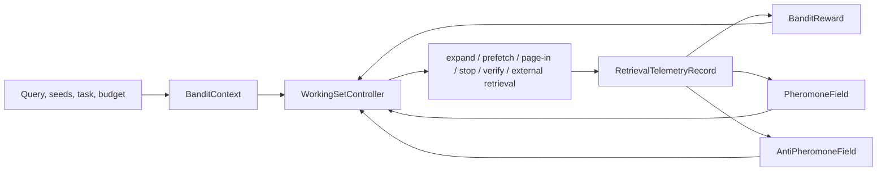

# Learned Working Set

Corrobore's working set is a bounded, explainable view used to navigate a graph without loading every node and relationship. Epic 0017 is implemented and benchmarked; its [migrated epic tracker #86](https://github.com/Estance-Labs/project-documents/issues/86) and [final acceptance issue #73](https://github.com/Estance-Labs/project-documents/issues/73) are complete.

This guide targets the current `0.1.x` runtime baseline.

## Implemented layers

| Layer | Public surface | Purpose |
| :--- | :--- | :--- |
| Lifecycle | `GraphWorkingSetManager` | Create working sets; load seeds; track hot relationships, warm adjacency, pins, dirty records, stats, and explanations. |
| Telemetry | `WorkingSetTelemetryRecorder`, `RetrievalTelemetryRecord` | Record selected/skipped edges, page-ins, prefetches, evictions, dead ends, evidence, quality, memory, and latency. |
| Positive field | `PheromoneField`, `EdgeUtility`, `PheromoneTaskScope` | Learn task-scoped expected utility with temporal decay. |
| Negative field | `AntiPheromoneField`, `AntiPheromoneSignal` | Penalize dead ends, supernodes, stale evidence, contradictions, and poisoning risk. |
| Controller | `WorkingSetController`, `BanditContext`, `WorkingSetAction`, `BanditReward` | Choose an explicit action under context and observe reward. |
| Benchmark | `run_working_set_benchmark`, `fimi_multi_hop_benchmark_workload` | Compare reproducible policy baselines and metrics. |

## Decision flow

The learned controller does not replace deterministic budgets or supernode protection. These remain hard safety boundaries.

## Benchmark policies and metrics

The harness represents LRU, LFU, static profiles, semantic-only, PageRank/spreading activation, contextual bandit, and learned pheromone policy families. Reports include evidence recall, pages loaded, peak memory, p95 latency, dead-end expansions, supernode blow-ups, and reproducibility metadata.

The target gains stated by Epic 0017 are measured research results on the reference workload, not general production performance guarantees. Use the completed [acceptance suite](https://github.com/Estance-Labs/corrobore/blob/main/crates/graph-core/tests/epic_0017_acceptance.rs) and [reproducibility report](https://github.com/Estance-Labs/project-documents/blob/main/feature-0017-learned-working-set/artifacts/0017-reproducibility-report.md) as the evidence source and scope for any performance statement.

For operational query boundaries and runtime policy behavior, use the
[HTTP Server guide](http-server.md) and [Cypher Support](cypher.md) as primary
references.
